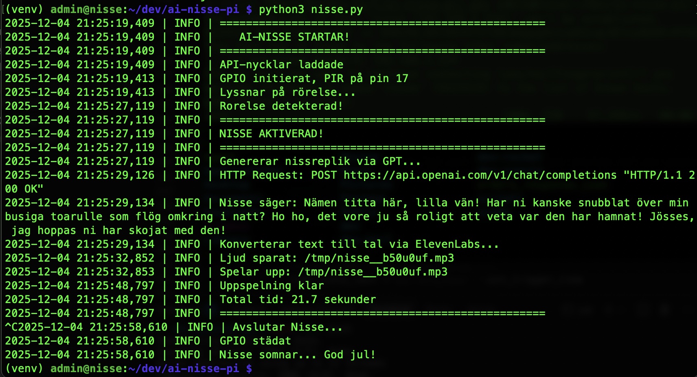

# AI-Nisse 🎅

En magisk nissedörr som pratar med barnen när de går förbi!

Raspberry Pi 5 + PIR-sensor + OpenAI + ElevenLabs = julens roligaste automation.




## Hur det fungerar


## Hårdvara

- Raspberry Pi 5
- PIR-sensor (HC-SR501 eller liknande)
- USB-högtalare

### Koppling

| PIR-sensor | Raspberry Pi |
|------------|--------------|
| VCC | Pin 2 (5V) |
| OUT | Pin 11 (GPIO17) |
| GND | Pin 6 (GND) |

## Installation

```bash
# Klona repot
git clone https://github.com/CARLOSMECK/ai-nisse-pi.git
cd ai-nisse-pi

# Skapa .env med API-nycklar
echo "openai_api_key=din-nyckel" > .env
echo "elevenlabs_api_key=din-nyckel" >> .env

# Kör installationsskriptet
sudo bash install.sh
```

## Filer

| Fil | Beskrivning |
|-----|-------------|
| `nisse.py` | Huvudprogrammet |
| `config.py` | Nissens personlighet (redigera här!) |
| `nissebrev.json` | Dagliga brev till barnen |
| `install.sh` | Installationsskript |

## Användning

### Manuell körning

```bash
source venv/bin/activate
python3 nisse.py
```

### Som bakgrundstjänst

Nissen körs automatiskt i bakgrunden och startar vid boot.

```bash
# Starta nissen
sudo systemctl start nisse

# Se status
sudo systemctl status nisse

# Följ loggar i realtid
sudo journalctl -u nisse -f

# Stoppa nissen
sudo systemctl stop nisse

# Starta om efter kodändringar
sudo systemctl restart nisse
```

## Justera volymen

```bash
# Visa USB-högtalarens volym (card 2)
amixer -c 2

# Sätt till 100%
amixer -c 2 set PCM 100%
```

## Anpassa nissen

Redigera `config.py` för att ändra nissens personlighet.

Redigera `nissebrev.json` för att lägga till dagliga brev som nissen refererar till.

## Testa

```bash
# Se vad som skickas till GPT (utan att anropa API)
python3 tests/test_prompt.py
```
